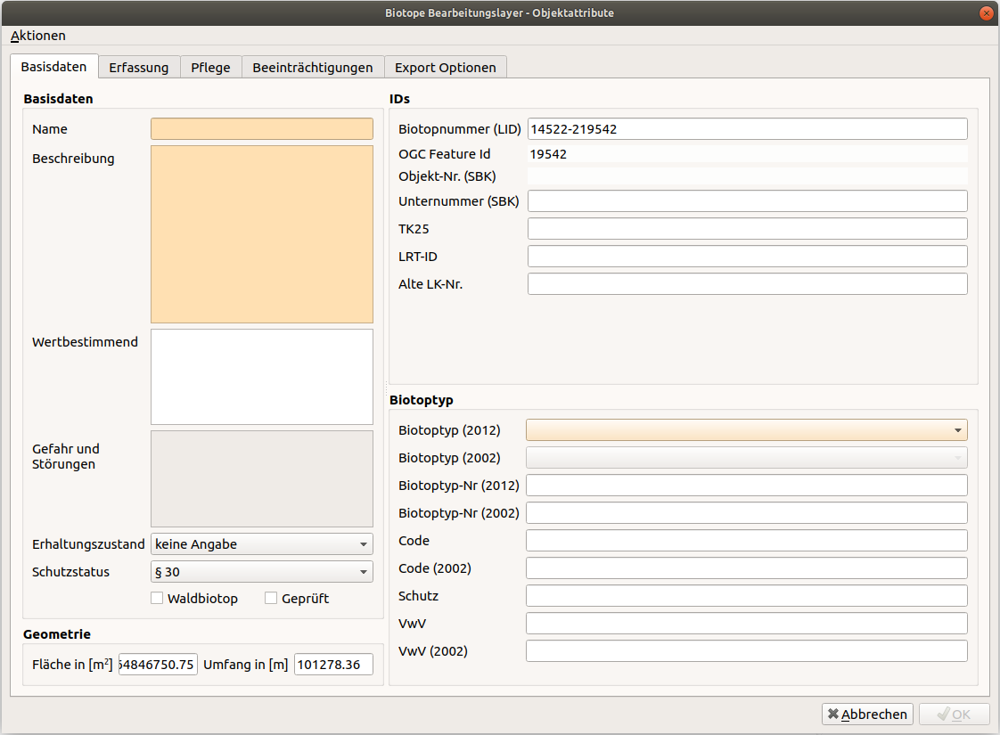
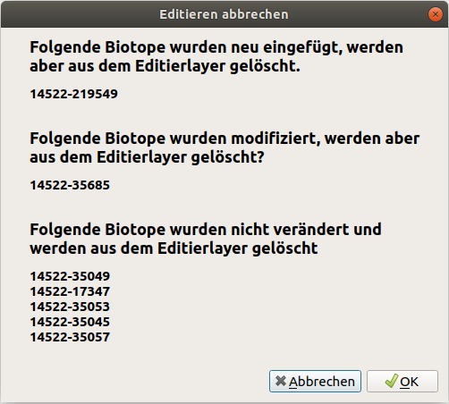
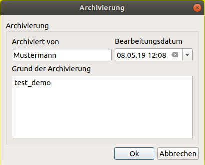
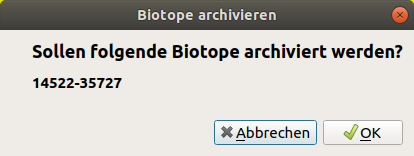
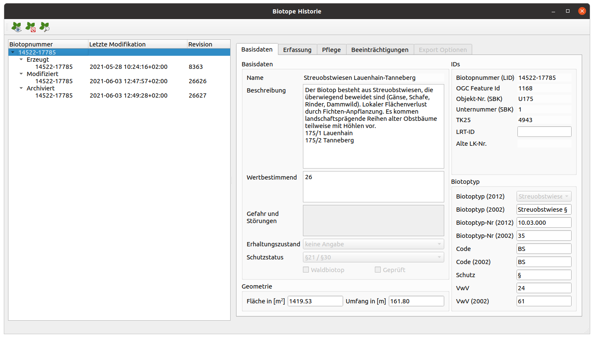

Funktionalität
==============

Neue Biotope erstellen
----------------------

Wenn Sie ein neues Biotop erstellen möchten, können Sie auf das |new| Icon ``Neue Biotope erstellen`` klicken. Sofort wechselt der Layer ``Biotope Bearbeitungslayer`` in den Bearbeitungsmodus. Nun können Sie die standard QGIS-Werkzeuge verwenden um ein neues Polygon und somit ein neues Biotop zu zeichnen. Wenn Sie mit einem Rechtsklick das Zeichnen beenden, öffnet sich automatisch das Objektattributfenster. Hier müssen nun manche Informationen eingetragen werden und andere sind optional. Die Fenster der Informationen die eingetragen werden müssen, sind gelb hinterlegt. Erst wenn Sie alle Pflichtfelder ausgefüllt haben, können sie das Formular mit dem ``OK`` Button schliessen.

Im Anschluss klicken Sie dann auf das |upload| Icon ``Editierte Biotope zurückführen und entsperren``. Das neu erstellte Biotop wird dann in den Hauptdatenbestand integriert. Sie können natürlich auch erstmal eine Vielzahl von Biotopen erstellen und diese dann zusammen speichern.

Ausgewählte Biotope editieren und sperren
-----------------------------------------

Um ein bereits vorhandenes Biotop zu editieren, selektieren sie dieses zuerst mit dem QGIS-Auswahlwerkzeug |select|. Wenn das zu ändernde Biotop ausgewählt wurde, muss die Bearbeitung über das Icon |edit| ``Ausgewählte Biotope editieren und sperren`` im ``GBD Biotopmanager`` gestartet werden. Nun wird das Biotop automatisch in den ``Biotope Bearbeitungslayer`` geschoben. Dies wird optisch dargestellt, indem die Biotope in diesem Layer mit einer gestrichelten Schraffur markiert werden. Zusätzlich wird dieses Biotop in den ``Gesperrte Biotope`` Layer verschoben, sodass kein anderer Nutzer gleichzeitig an diesem arbeiten kann. So kann kein Konflikt innerhalb der Daten entstehen. Nun können die Attribute und die Geometrie editiert werden.

Wählen Sie zum editieren der Attribute das QGIS-Werkzeug |attributes| ``Objekte abfragen`` aus und klicken Sie auf das zu bearbeitende Biotop. Nun öffnet sich das Objektattributfenster, in welchem Sie Ihre gewünschten Änderungen eintragen können.

Zum Editieren der Geometrie werden die QGIS-Digitalisierungswerkzeuge verwendet. Sobald ein Biotop im den ``Biotope Bearbeitungslayer`` verschoben wurde, kann die Geometrie frei verändert werden. Wenn Sie Fragen zu den QGIS-Digitalisierungswerkzeugen haben, finde Sie eine ausführliche Hilfe hier:

**https://docs.qgis.org/latest/de/docs/user_manual/working_with_vector/editing_geometry_attributes.html**

Sie können natürlich auch erstmal eine Vielzahl von Biotopen auswählen, diese dann nacheinander bearbeiten und zusammen wieder mit dem Icon in den Hauptdatenbestan zurückschreiben. Dazu klicken Sie dann auf das |upload| Icon ``Editierte Biotope zurückführen und entsperren``.

Editierte Biotope zurückführen und entsperren
---------------------------------------------

Wenn Sie ein neues Biotop erstellt oder ein schon vorhandenes Biotop editiert haben, muss dieses aus dem ``Biotope Bearbeitungslayer`` Layer in den ``Biotope`` Layer geschrieben werden. Klicken Sie dazu auf das Icon |upload| ``Editierte Biotope zurückführen und entsperren``. Sie bekommen dann nochmal eine Liste alle neu erstellten und veränderten Biotope, die nach einer Bestätigung in den Layer ``Biotope`` geschrieben werden. Die Sperrung der Biotope wird dann aufgehoben, so dass andere Benutzer diese wieder editieren können.

Editieren abbrechen und Biotope Bearbeitungslayer leeren
--------------------------------------------------------

Falls Sie das Editieren eines Biotops gestartet haben, können Sie dies über das Icon |stop| ``Editieren abbrechen und Biotope Bearbeitungslayer leeren`` abbrechen. Sobald Sie dieses Werkzeug anklicken öffnet sich ein Dialogfenster. In diesem findet eine Auflistung der verschiedenen Biotope zur Übersicht statt. Zum Einen wird angezeigt, welche Biotope neu eingefügt oder modifiziert wurden. Diese werden entfernt, wenn Sie auf ``OK`` klicken. Zum Anderen findet eine Auflistung der nicht veränderten Biotope statt. Diese werden aus dem ``Biotope Bearbeitungslayer`` gelöscht und in den ``Biotope`` Layer verschoben, wenn Sie auf ``OK`` klicken.

Ausgewählte Biotope archivieren
-------------------------------

Das ``GBD Biotopmanager`` Plugin bietet eine interne Archivierung an. Biotope werden also nie gelöscht, sondern stattdessen archiviert. Wählen Sie dafür mit dem QGIS-Werkzeug |select| das Biotop aus, welches Sie archivieren möchten. Klicken Sie dann auf das Icon |archive| ``Ausgewählte Biotope archivieren``. Es öffnet sich dann das Dialogfenster ``Archivierung``, in dem Sie sich als Archivierer, ein Datum und einen Grund für die Archivierung eintragen müssen.

Klicken Sie dann auf ``Ok``. Das Fenster schließt sich und es öffnet sich zur Kontrolle ein letztes Fenster.

In diesem Fenster findet eine Auflistung der Biotope statt, die archiviert werden wenn Sie auf ``OK`` klicken. Über ``Abbrechen`` kann die Archivierung abgebrochen werden. Archivierte Biotope werden aus dem Layer ``Biotope`` gelöscht und sind nun nur noch im Layer ``Archivierte Biotope`` vorhanden. Die Darstellung in der Karte ist ein helles grau.

Historie ausgewählter Biotope anzeigen
--------------------------------------

Zu jedem Biotop wird eine Historie angelegt. Im Historiendialog, welcher über das Icon |history| ``Historie ausgewählter Biotope anzeigen`` aufgerufen werden kann, werden die Veränderungen (Erzeugung, Modifizierungen, Archivierung) aufgelistet. So kann ein Überblick über die einzelnen Veränderungen gewonnen werden.

Über das Historiendialogfenster sind 3 weitere Werkzeuge anwählbar. 

Zeige Historie für selektierte Biotope
~~~~~~~~~~~~~~~~~~~~~~~~~~~~~~~~~~~~~~

Durch das Anklicken des |show| Icon ``Zeige Historie für selektierte Biotope`` wird die Historie für ein oder mehrere Biotope angezeigt. 

Entferne Umrandung
~~~~~~~~~~~~~~~~~~

Mit Hilfe des Werkzeuges |delete| ``Entferne Umrandung`` kann die Umrandung der ausgewählten, archivierten Biotope entfernt werden, die zur besseren Identifizierung in der Karte genutzt wird. 

Zoome zu historischem Biotop
~~~~~~~~~~~~~~~~~~~~~~~~~~~~

Als letztes kann das Biotop fokussiert werden mit dem Icons |find| ``Zoome zu historischem Biotop``.

Handbuch Biotopmanager
----------------------

Mit dem |help| Icon wird dieses Handbuch in Ihrem Standard Webbrowser geöffnet.

 .. |new| image:: ./images/leaf-add-01.svg
   :width: 25em
 .. |edit| image:: ./images/leaf-edit-01.svg
   :width: 25em
 .. |upload| image:: ./images/leaf-save-01.svg
   :width: 25em
 .. |stop| image:: ./images/leaf-cancel-01.svg
   :width: 25em
 .. |archive| image:: ./images/leaf-archive-01.svg
   :width: 25em
 .. |history| image:: ./images/leaf-history-01.svg
   :width: 25em
 .. |select| image:: ./images/select.svg
   :width: 25em
 .. |attributes| image:: ./images/attributes.svg
   :width: 25em
 .. |delete| image:: ./images/leaf-cancel-01.svg
   :width: 25em
 .. |show| image:: ./images/leaf-show-01.svg
   :width: 25em
 .. |find| image:: ./images/leaf-zoom-01.svg
   :width: 25em
 .. |help| image:: ./images/leaf-help-01.svg
   :width: 25em  
   
   
