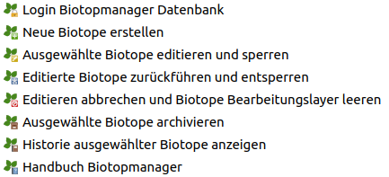

Einführung
==========

Der ``GBD Biotopmanager`` ist ein QGIS Plugin zur Verwaltung von Biotopen. Die Daten sind in einer PostGIS Datenbank abgelegt. Diese managed das Erstellen, Bearbeiten, Löschen und Archivieren der Daten sowie die Benutzer- und Rechteverwaltung.

Das Plugin dient der Visualisierung und Bearbeitung von Biotopen. Es ist möglich neue Biotope zu erstellen sowie vorhandene Biotope zu bearbeiten oder zu löschen. Außerdem bietet das ``GBD Biotopmanager`` Plugin eine Historisierung, welche es ermöglicht, jede Veränderung aus der Vergangenheit nachzuvollziehen. So können Veränderungen nachvollzogen und bei Bedarf korrigiert werden.

Übersicht Werkzeuge
~~~~~~~~~~~~~~~~~~~ 

Eine detailierte Beschreibung der Funktionalität finden Sie im Kapitel ``Funktionsübersicht``. Zur Übersicht hier aber schonmal eine einfache Liste der vorhandenen Werkzeuge.

