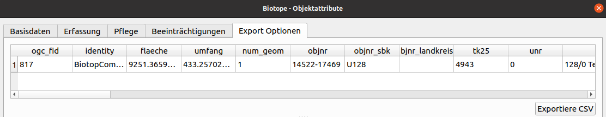
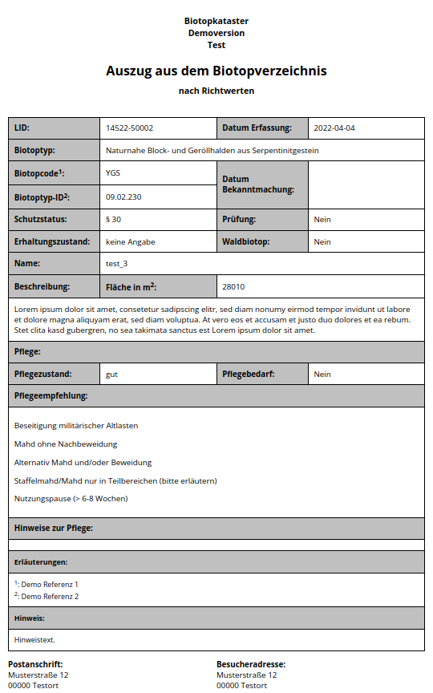

CSV Export und Bericht
======================

Über den Reiter ``Export Optionen`` des Attributformulars können Sie die Sachdaten zu einem Biotop als CSV exportieren.

Desweiteren können Sie an dieser Stelle auch einen Bericht als HTML zum ausdrucken erstellen. Der Bericht wird über das Icon ``Exportiere HTML`` in dem Standard Webbrowser geöffnet und kann von dortaus ausgedruckt oder als PDF gespeichert werden.

